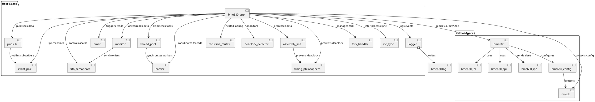

# BME680 Environmental Sensor Driver and Application

This project provides a **Linux kernel module** and **user-space application** for interfacing with the **BME680** environmental sensor (Bosch Sensortec) on embedded systems like the Raspberry Pi. It implements a robust, multithreaded system using **Thread Synchronization Design Patterns** to collect, process, and publish environmental data (temperature, pressure, humidity, and gas resistance). Designed for **IoT applications**, environmental monitoring, and educational purposes, it demonstrates expert-level kernel and user-space programming.

## Features
- **Real-time Sensor Data Collection**: Reads temperature, pressure, humidity, and gas resistance from the BME680 sensor every second (configurable).
- **Multithreaded Processing**: Utilizes a thread pool, pipeline (assembly line), and publisher-subscriber model for efficient, parallel data processing.
- **Thread Synchronization**: Implements advanced patterns including:
  - Thread Pool, Monitor, Publisher-Subscriber, Read-Write Lock, Recursive Mutex.
  - FIFO Semaphore, Event Pair, Barrier, Dining Philosophers, Deadlock Detection.
- **Kernel Integration**: Supports I2C and SPI interfaces via kernel modules, with Industrial I/O (IIO) framework and IPC (Netlink/System V) for alerts.
- **Robustness**: Includes timeout mechanisms (5s), cleanup handlers, and deadlock prevention/detection for reliability in production environments.
- **Scalability**: Configurable thread counts, pipeline stages, and oversampling rates for varying workloads.
- **Logging and Testing**: Comprehensive logging (`bme680.log`) and multithreaded test suite to validate performance and thread safety.
- **IoT Integration**: Publishes data via pub/sub for integration with platforms like MQTT, Home Assistant, or AWS IoT.
- **Educational Value**: Demonstrates advanced multithreading and kernel programming patterns for teaching purposes.

## Project Overview

The project consists of **40 source files** (kernel-space and user-space) providing a complete IoT solution for:
- **Kernel-space**: Linux kernel driver for BME680, supporting I2C/SPI, IIO, and IPC for threshold-based alerts.
- **User-space**: Multithreaded application (`bme680_app`) that reads, processes, and publishes sensor data using synchronization patterns.
- **Synchronization Patterns**: Thread Pool, Pipeline, Publisher-Subscriber, Monitor, Read-Write Lock, Recursive Mutex, FIFO Semaphore, Event Pair, Barrier, Dining Philosophers, Deadlock Detection, Timer, and IPC Synchronization.

### Purpose of the Project
1. **Environmental Monitoring**: Collect real-time data for temperature, pressure, humidity, and gas resistance.
2. **Robust Multithreading**: Process data efficiently using thread-safe, scalable synchronization patterns.
3. **Alerting and Integration**: Send alerts via IPC when thresholds are exceeded and integrate with IoT systems.
4. **Reliability**: Ensure no crashes, memory leaks, or deadlocks through cleanup handlers and deadlock detection.
5. **Education**: Demonstrate advanced multithreading and kernel programming for embedded systems courses.

### Applications
- **Smart Homes**: Monitor indoor air quality (e.g., VOC detection) to control HVAC or air purifiers.
- **Industrial Monitoring**: Track environmental conditions in factories, warehouses, or cleanrooms.
- **Healthcare**: Maintain optimal conditions in hospitals or labs.
- **Smart Cities**: Monitor urban air quality or weather in sensor networks.
- **Education**: Teach multithreading, synchronization, and kernel programming.

## Code Structure
The project is organized into kernel-space and user-space components, with clear separation of concerns for modularity and maintainability.

### Kernel-Space Components
- **bme680.c / bme680.h**: Core driver logic for BME680 initialization, configuration, and data reading via IIO.
- **bme680_i2c.c / bme680_i2c.h**: I2C interface for communication with BME680 (default address 0x77).
- **bme680_spi.c / bme680_spi.h**: SPI interface for alternative communication.
- **bme680_ipc.c / bme680_ipc.h**: IPC module for sending alerts via Netlink/System V when sensor data exceeds thresholds.
- **bme680_config.c / bme680_config.h**: Thread-safe configuration management for oversampling and filters.
- **bme680.dtbo**: Device Tree overlay for enabling I2C/SPI on Raspberry Pi.

### User-Space Components
- **bme680_app.c / bme680_app.h**: Main application coordinating sensor reading, processing, and publishing.
- **thread_pool.c / thread_pool.h**: Thread pool for parallel task execution with CPU affinity.
- **monitor.c / monitor.h**: Synchronized FIFO buffer for sensor data.
- **pubsub.c / pubsub.h**: Publisher-Subscriber model for data dissemination.
- **logger.c / logger.h**: Logging system for debugging and monitoring (`bme680.log`).
- **timer.c / timer.h**: Periodic timer for sensor reading (default: 1s).
- **event_pair.c / event_pair.h**: Two-way thread synchronization.
- **fifo_semaphore.c / fifo_semaphore.h**: FIFO semaphore for fair resource access.
- **assembly_line.c / assembly_line.h**: Pipeline for processing sensor data in stages.
- **rwlock.c / rwlock.h**: Read-Write lock for concurrent access with timeout.
- **recursive_mutex.c / recursive_mutex.h**: Recursive mutex for nested locking.
- **deadlock_detector.c / deadlock_detector.h**: Deadlock detection by tracking lock ownership.
- **dining_philosophers.c / dining_philosophers.h**: Deadlock prevention using Dining Philosophers algorithm.
- **barrier.c / barrier.h**: Barrier synchronization for thread coordination.
- **fork_handler.c / fork_handler.h**: Manages fork in multithreaded applications.
- **ipc_sync.c / ipc_sync.h**: Inter-Process Synchronization via System V semaphores.
- **Supporting files**: Headers like `bme680_fifo_data.h`, `thread_pool_task.h`, etc., for data structures and interfaces.

### Supporting Files
- **Makefile**: Builds kernel modules, device tree overlay, and application with test targets.
- **test_multithread.c**: Test suite for validating multithreading performance and data integrity.

## UML Diagram
Below is a textual representation of the UML class diagram for the project, showing key components and their relationships. (For a visual diagram, use a UML tool like PlantUML with this code.)




**Explanation**:
- **Kernel-Space**: `bme680` is the central driver, using `bme680_i2c` or `bme680_spi` for communication, `bme680_ipc` for alerts, and `bme680_config` for settings (protected by `rwlock`).
- **User-Space**: `bme680_app` orchestrates all components, reading sensor data via `/dev/i2c-1`, processing through `thread_pool` and `assembly_line`, and publishing via `pubsub`. Synchronization is handled by `monitor`, `fifo_semaphore`, `event_pair`, `rwlock`, `recursive_mutex`, `barrier`, and `dining_philosophers`. `deadlock_detector` monitors for deadlocks, and `logger` records events.
- **Relationships**: Arrows indicate dependencies or interactions (e.g., `bme680_app` uses `thread_pool` to dispatch tasks).

## Covered Technical Concepts

This project covers many core concepts in system programming and multithreading, particularly those adhering to POSIX standards. Below is a detailed explanation of each concept and whether it is implemented in the project, grouped by the specified topics.

### File Operation, System Call, Library Functions, Compiling Using GNU-GCC, Blocking and Non-Blocking Call, Atomic Operation, Race Condition, User and Kernel Mode
- **File Operation**: The project uses functions like `open()`, `read()`, `write()`, `ioctl()` in `bme680_app.c` to open and read/write data from the `/dev/i2c-1` device. `logger.c` uses `fopen()`, `fwrite()`, `fclose()` to log to `bme680.log`. These are standard POSIX file operations.
- **System Call**: Utilizes `fork()` in `fork_handler.c`, `open()`, `ioctl()` in `bme680_app.c`, and `sysconf()` to retrieve CPU count. In kernel-space, functions like `regmap_read()` implicitly invoke system calls.
- **Library Functions**: Employs POSIX-compliant library functions such as `malloc()`, `free()` (stdlib.h), `pthread_create()` (pthread.h), `snprintf()` (stdio.h), `usleep()` (unistd.h).
- **Compiling Using GNU-GCC**: The `Makefile` uses `gcc` to compile the user-space application (`bme680_app.c`, etc.) with flags like `-pthread`, `-lrt`. Kernel modules are compiled using the kernel build system but are GCC-compatible.
- **Blocking and Non-Blocking Call**: Blocking calls include `pthread_cond_wait()`, `pthread_mutex_lock()` in `rwlock.c`, `fifo_semaphore.c`. Non-blocking calls include `pthread_cond_timedwait()`, `pthread_mutex_timedlock()` with a 5-second timeout to prevent indefinite blocking.
- **Atomic Operation**: Uses mutexes/spinlocks to ensure atomicity (e.g., `mutex_lock()` in `bme680.c`, `pthread_mutex_lock()` in `pubsub.c`). However, direct use of `__atomic_*` (GCC) or `atomic_t` (kernel) is absent.
- **Race Condition**: Prevented using mutexes (`pthread_mutex_t` in `monitor.c`), read-write locks (`rwlock.c`), and deadlock detection (`deadlock_detector.c`).
- **User and Kernel Mode**: User mode includes `bme680_app.c`, `thread_pool.c` running in user-space. Kernel mode includes `bme680.c`, `bme680_i2c.c` running in kernel-space, interacting via `/dev/i2c-1` and `ioctl()`.

### Process Management - Process Creation, Termination, Fork() System Call, Child-Parent Process, Command Line Argument of Process, Memory Layout of Process
- **Process Creation**: Uses `fork()` in `fork_handler.c` to create child processes in a multithreaded environment.
- **Process Termination**: Employs `exit()` in child processes (`fork_handler.c`) and graceful shutdown via a `running` flag in `bme680_app.c`.
- **Fork() System Call**: Implemented in `fork_handler.c`, with thread cleanup in child processes to avoid zombie threads.
- **Child-Parent Process**: `fork_handler.c` manages parent-child relationships, with child processes performing separate tasks and exiting cleanly.
- **Command Line Argument of Process**: Handles `argc`, `argv` in `main()` of `bme680_app.c` for configuration (e.g., `-i`, `-t`, `-s`).
- **Memory Layout of Process**: Manages heap via `malloc()`/`free()` (e.g., in `monitor.c`). Stack is used for local variables, and code/data segments are handled through compilation. However, no explicit illustration of memory layout (e.g., via `/proc/<pid>/maps`).

### Signals - Signal Handlers, Sending Signals to Process, Default Signal Handlers
- **Signal Handlers**: The project does not implement `signal()` or `sigaction()` to handle signals (e.g., SIGINT, SIGTERM).
- **Sending Signals to Process**: Does not use `kill()` or `raise()` to send signals.
- **Default Signal Handlers**: Does not modify default handlers (e.g., SIGINT handled by default on Ctrl+C).

### POSIX Threads - Thread Creation, Thread Termination, Thread ID, Joinable and Detachable Threads
- **Thread Creation**: Uses `pthread_create()` in `thread_pool.c`, `timer.c`, `assembly_line.c`.
- **Thread Termination**: Uses `pthread_join()`, `pthread_cancel()` in `thread_pool_destroy()`, `timer_destroy()`.
- **Thread ID**: Uses `pthread_self()` in `bme680_app.c` to retrieve thread IDs.
- **Joinable and Detachable Threads**: All threads are joinable (`pthread_join()`), with no use of detachable threads (`PTHREAD_CREATE_DETACHED`).

### Thread Synchronisation - Mutex, Condition Variables
- **Mutex**: Uses `pthread_mutex_t` in `pubsub.c`, `monitor.c`, and recursive mutex in `recursive_mutex.c`.
- **Condition Variables**: Uses `pthread_cond_t` and `pthread_cond_timedwait()` in `rwlock.c`, `thread_pool.c`, `event_pair.c`.

### Inter Process Communication (IPC) - Pipes, FIFO, POSIX Message Queue, POSIX Semaphore, POSIX Shared Memory
- **Pipes**: Not implemented.
- **FIFO**: Not implemented (no named pipes via `mkfifo()`).
- **POSIX Message Queue**: Not implemented (no `mq_open()`, `mq_send()`).
- **POSIX Semaphore**: Not implemented (`sem_open()`, `sem_wait()`), but `ipc_sync.c` uses System V semaphores (`semget()`, `semop()`), which are functionally equivalent.
- **POSIX Shared Memory**: Not implemented (no `shm_open()`, `mmap()`).

### Memory Management - Process Virtual Memory Management, Memory Segments (Code, Data, Stack, Heap)
- **Process Virtual Memory Management**: Manages heap via `malloc()`/`free()` in `monitor.c`, `thread_pool.c`.
- **Memory Segments**: Code (compiled code), Data (global variables), Stack (local variables), Heap (`malloc()`). No detailed illustration provided.

## Installation and Usage

### Prerequisites
- **Hardware**: Raspberry Pi (e.g., Raspberry Pi 3/4) with BME680 sensor connected via I2C (address 0x77) or SPI.
- **Software**:
  - Raspberry Pi OS (kernel 5.x or later).
  - Tools: `gcc`, `make`, `dtc`, `libi2c-dev` (`sudo apt install build-essential raspberrypi-kernel-headers device-tree-compiler libi2c-dev`).
- **Wiring**: Connect BME680 to I2C pins (SDA: GPIO 2, SCL: GPIO 3) or SPI pins.


### Step-by-Step Installation

#### Step 1: Enable I2C/SPI Interface
1. Enable I2C (or SPI) on Raspberry Pi:
   ```bash
   sudo raspi-config
   ```
   - Go to `Interfacing Options` → `I2C` → Enable (or `SPI` for SPI mode).
   - Reboot: `sudo reboot`.

2. Verify I2C device detection:
   ```bash
   i2cdetect -y 1
   ```
   Look for address `0x77` (BME680 default).

#### Step 2: Apply Device Tree Overlay
1. Navigate to `/boot`:
   ```bash
   cd /boot
   ```

2. Convert the device tree blob (`.dtb`) to source (`.dts`) for your Raspberry Pi model:
   ```bash
   dtc -I dtb -O dts -o bcm2710-rpi-3-b.dts bcm2710-rpi-3-b.dtb
   ```
   **Note**: Replace `bcm2710-rpi-3-b.dtb` with your model's `.dtb` (e.g., `bcm2711-rpi-4-b.dtb` for Raspberry Pi 4).

3. Edit the `.dts` file to enable I2C-1 and add BME680:
   ```bash
   nano bcm2710-rpi-3-b.dts
   ```
   Add under the `i2c1` node:
   ```dts
   &i2c1 {
       status = "okay";
       bme680@77 {
           compatible = "bosch,bme680";
           reg = <0x77>;
       };
   };
   ```
   Save and exit.

4. Recompile the `.dts` to `.dtb`:
   ```bash
   dtc -I dts -O dtb -o bcm2710-rpi-3-b.dtb bcm2710-rpi-3-b.dts
   ```

5. Apply the provided device tree overlay:
   ```bash
   sudo dtoverlay bme680.dtbo
   ```

6. Reboot:
   ```bash
   sudo reboot
   ```

#### Step 3: Build the Project
1. Clone or copy the project:
   ```bash
   git clone <repository_url>  # If hosted
   cd bme680_project
   ```

2. Build all components:
   ```bash
   make all clean
   ```

   **Individual build options**:
   - Kernel modules:
     ```bash
     make driver clean
     ```
   - Device tree overlay:
     ```bash
     make tree
     ```
   - User-space application:
     ```bash
     make app
     ```

3. Generated files:
   - Kernel modules: `bme680_core.ko`, `bme680_i2c.ko`, `bme680_spi.ko`, `bme680_ipc.ko`.
   - Device tree overlay: `bme680.dtbo`.
   - Application: `bme680_app`.

#### Step 4: Install Kernel Modules
1. Install modules:
   ```bash
   sudo insmod bme680_core.ko
   sudo insmod bme680_i2c.ko  # or bme680_spi.ko for SPI
   sudo insmod bme680_ipc.ko
   ```

2. Verify installation:
   ```bash
   dmesg | grep bme680
   ```
   Expected output: `bme680: Device initialized at address 0x77`.

3. Remove modules (if needed):
   ```bash
   sudo rmmod bme680_ipc
   sudo rmmod bme680_i2c  # or bme680_spi
   sudo rmmod bme680_core
   ```

#### Step 5: Run the Application
1. Run with default settings (4 threads, 5 stages, 1s interval):
   ```bash
   ./bme680_app
   ```

2. Run with custom parameters:
   ```bash
   ./bme680_app -i 1000 -t 8 -s 10
   ```
   - `-i <iterations>`: Test iterations (default: 10).
   - `-t <threads>`: Thread pool size (default: 4).
   - `-s <stages>`: Pipeline stages (default: 5).
   - `--test`: Run test mode with valid/invalid data.

3. Check logs:
   ```bash
   cat bme680.log
   ```
   Example output: `Temp: 25.50 C, Pressure: 101325 Pa, Humidity: 50%, Gas: 100000 Ohms`.

4. Stop: Press `Ctrl+C` (graceful shutdown).

#### Step 6: Run Tests
1. Run multithreaded tests:
   ```bash
   make test_multithread
   ```
   Tests 4, 8, 16 threads with 500ms, 1000ms, 2000ms intervals.

2. Verify thread safety:
   ```bash
   valgrind --tool=helgrind ./bme680_app -t 8
   ```

#### Step 7: Cleanup
1. Remove device tree overlay:
   ```bash
   sudo dtoverlay -r bme680
   ```

2. Clean build artifacts:
   ```bash
   make clean
   ```

3. Clean all except sources:
   ```bash
   make cleanall
   ```

### Usage Notes
- **Output**: Data logged to `bme680.log` and published via `pubsub` for external subscribers.
- **Alerts**: `bme680_ipc.ko` sends alerts via Netlink/System V for threshold violations.
- **Customization**:
  - Adjust oversampling/thresholds in `bme680_config.h`.
  - Modify timer interval or thread count in `bme680_app.c`.
- **Integration**: Use `pubsub.c` for MQTT/REST API integration.

### Troubleshooting
- **I2C not detected**: Verify I2C enabled (`raspi-config`) and BME680 wiring (`i2cdetect -y 1`).
- **Module load failure**: Check `dmesg` and ensure kernel headers match (`uname -r`).
- **Application errors**: Inspect `bme680.log` for issues (e.g., semaphore timeout).

### Contributing
1. Fork the repository.
2. Create a branch (`git checkout -b feature-name`).
3. Commit changes (`git commit -m "Add feature"`).
4. Push (`git push origin feature-name`).
5. Open a pull request.

### License
MIT License. See `LICENSE` file.
